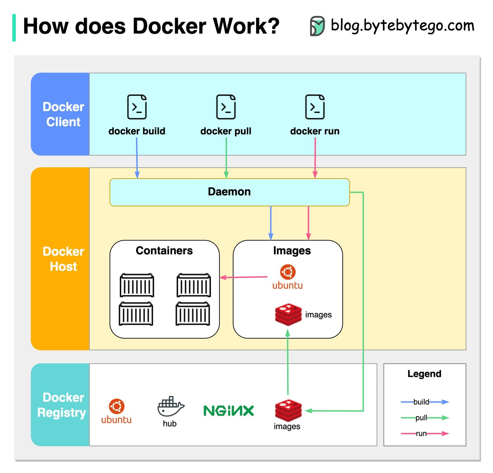

.. _ref-docker-command:

**************
Docker Command
**************

.. contents:: Table of Contents

---------

**docker documentation**: link_

.. _link: https://docs.docker.com/desktop/

Basic Management
================

.. code:: console
    
     $ docker run: docker run -d -p 8080:80 nginx

     This command runs an Nginx container in detached mode, maps port 80 of the container to port 8080 of the host.

     $ docker build: docker build -t myapp .

     Builds an image from a Dockerfile in the current directory and tags it as myapp.

     $ docker pull: docker pull ubuntu

     Pulls the latest Ubuntu image from the Docker Hub.

     $ docker push: docker push myusername/myapp

     Pushes the myapp image to your Docker Hub repository.

Container Management
====================

.. code:: console

    $ docker ps: docker ps -a

    Lists all containers, including those that are stopped.

    $ docker start: docker start my_container

    Starts a container named my_container.

    $ docker stop: docker stop my_container

    Stops the running container named my_container.

    $ docker restart: docker restart my_container

    Restarts my_container.

    $ docker rm: docker rm my_container

    Removes my_container.

    $ docker logs: docker logs my_container

    Fetches logs of my_container.

    $ docker exec: docker exec -it my_container bash

    Executes an interactive bash shell inside my_container.

Image Management
================

.. code:: console

    $ docker images: docker images

    Lists all local Docker images.

    $ docker rmi: docker rmi nginx

    Removes the Nginx image.

    $ docker tag: docker tag myapp myusername/myapp:1.0

    Tags the myapp image for version 1.0 in your repository.

    $ docker commit: docker commit my_container mynewimage

    Creates a new image named mynewimage from changes made in my_container.

Volume and Network Management
=============================

.. code:: console

    $ docker volume create: docker volume create myvolume

    Creates a new volume named myvolume.

    $ docker volume ls: docker volume ls

    Lists all Docker volumes.

    $ docker volume rm: docker volume rm myvolume

    Removes the volume named myvolume.

    $ docker network create: docker network create mynetwork

    Creates a new network named mynetwork.

    $ docker network ls: docker network ls

    Lists all Docker networks.

    $ docker network rm: docker network rm mynetwork

    Removes the network named mynetwork.

System-Wide Information
=======================

.. code:: console

    $ docker info: docker info

    Displays system-wide information about Docker.

    $ docker version: docker version

    Shows Docker version information.

Docker Compose
==============

.. code:: console

    $ docker-compose up: docker-compose up

    Starts up your application as defined in the docker-compose.yml file.

    $ docker-compose down: docker-compose down

    Stops and removes resources created by docker-compose up.

Miscellaneous
=============

.. code:: console

    $ docker inspect: docker inspect my_container

    Returns detailed information about my_container.

    $ docker search: docker search nginx

    Searches for Nginx images in the Docker Hub.

    $ docker login: docker login

    Logs into the Docker registry.

    $ docker logout: docker logout

    Logs out from the Docker registry.

Advanced Commands
=================

.. code:: console

    $ docker cp: docker cp my_container:/path/to/file /local/path

    Copies a file from my_container to the local file system.

    $ docker diff: docker diff my_container

    Shows changes to files or directories in my_container's filesystem.

    $ docker save: docker save myimage > myimage.tar

    Saves myimage to a tar archive.

    $ docker load: docker load < myimage.tar

    Loads an image from a tar archive.